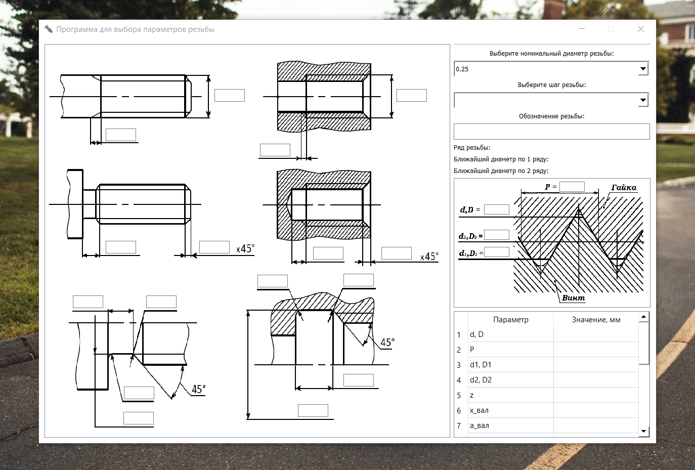

<h1>Программа для выбора параметров резьбы исходя из номинального диаметра и шага</h1>
<h3>Оконное приложение с графическим интерфейсом, входные данные которого являются номинальный диаметр резьбы (d, D) и шаг резьбы (P)</h3>

Функционал:
1. Название резьбы по ГОСТ
2. Подбор ближайшего диаметра из 1 и 2 ряда
3. Вывод основных параметров и параметров выхода резьбы для выбранного диаметра и шага в удобной графической форме на чертеже
4. Вывод основных параметров и параметров выхода резьбы для выбранного диаметра и шага в таблицу

Использованы следующий стандарты:

ГОСТ 24705-2004 - Резьба метрическая. Основные размеры

ГОСТ 10549-80 - Выход резьбы

ГОСТ 8724-2002 - Резьба метрическая. Диаметры и шаги

По поводу предложений и багов писать сюда: lopukhov.evgeniy.o@gmail.com

